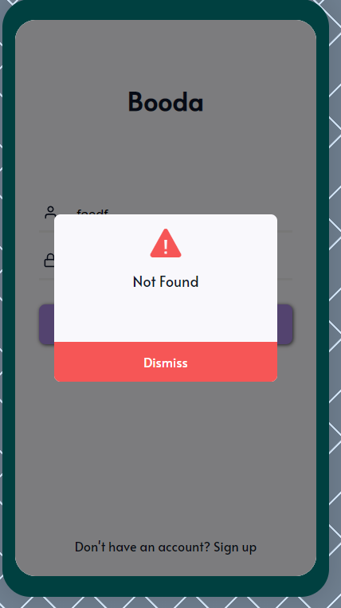

# Booda Meditation App

## Description

Booda is a social media based around meditation. You can use the timer to time/record your session, and then upload a comment and/or image along with it if you wish. There is also a Home/Feed page where you can see all of the people you follow's meditation sessions, give them a thumbs up, and comment on their post. Finally, there is a profile page where you can see your total stats, along with graphs, achievements, and monthly challenges you can participate in. See below for previews of all of this and more!

The front end was built using React.js. The back end was built using Node.js, using MongoDB as the database. Although this app was built using React for the web, it was made with mobile in mind. I intend to learn a mobile language in the near future and re-create this app for real, bigger and better.

## Demo

This app is live! Find it at https://booda-app.herokuapp.com
Use the email 'test@test.com' and the password 'test' so that you can have the full experience. This user has a bunch of friends, posts and stats so that you may see all features of the app.

A video of me presenting the app can also be found here: https://www.youtube.com/watch?v=j0oqW3RD2DM

## Features

### Login

The log-in page for the app.
If you would like to log-in to test the app, use this login:
email: test@test.com
password: test

### Sign-up

A sign-up page. All fields are required and passwords must match to create an account.

### Feed

The feed! You can view all your friends' posts, give them a thumbs up, and comment if you so wish. You can also swipe up to refresh the feed!

### Timer

The timer for the app. You can drag the number up and down to adjust the time of the session. Once you click start, the time counts down until it is finished. A modal then pops up and you can add a comment and/or image.

### Profile

On your profile (or your friends profile), you can see your stats, achievements, and your challenges that you are currently participating in (or join new ones!).

### Settings

A small settings modal which pops up if you click the gear on the timer page.

### Error

An error modal which pops up in the case of any user error during login/sign-up.
